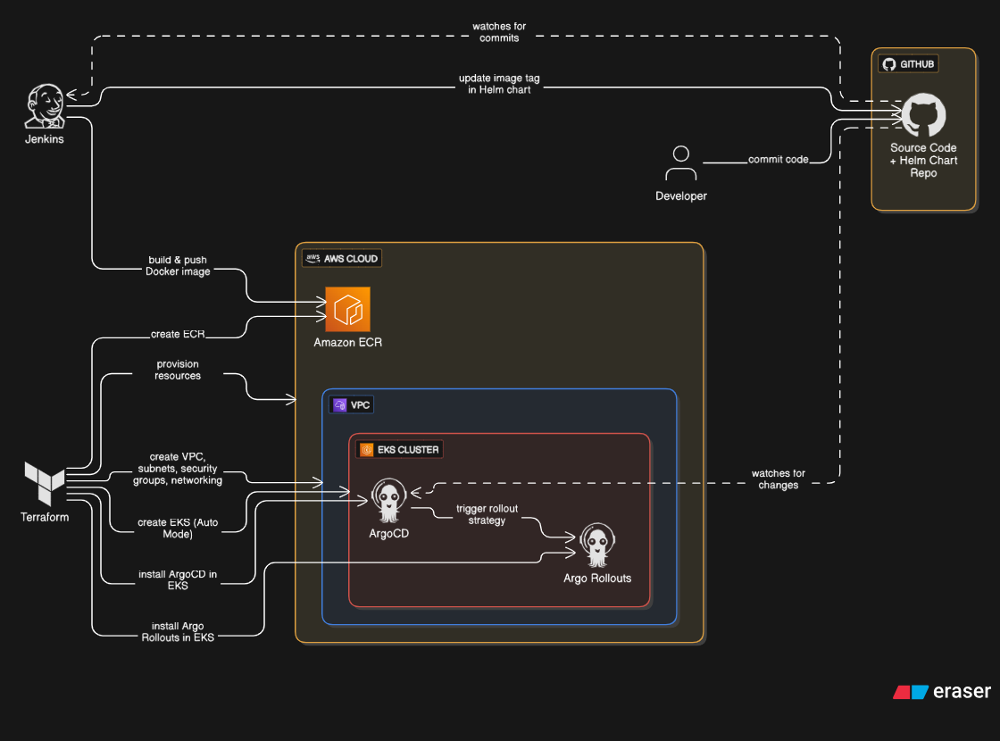

# 🚀 CloudNative DevOps Blueprint

  

*A comprehensive DevOps blueprint for deploying cloud-native applications with enterprise-grade tooling*

## Architecture

---

**⭐ Star this repository if you find it helpful!**

<!-- *Built with ❤️ for the DevOps community* -->

