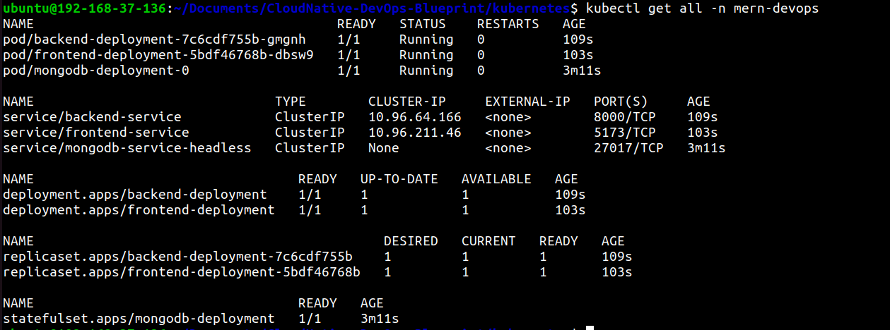

# Kubernetes Deployment with Kind

## Cluster Configuration: `kind-config.yaml`

```yaml
kind: Cluster
apiVersion: kind.x-k8s.io/v1alpha4
nodes:
  - role: control-plane
    extraPortMappings:
      - containerPort: 80   # for nginx ingress
        hostPort: 80
        protocol: TCP
      - containerPort: 443  # for HTTPS ingress
        hostPort: 443
        protocol: TCP
      - containerPort: 31000 # for frontend container
        hostPort: 31000
        protocol: TCP
      - containerPort: 31100 # for backend container
        hostPort: 31100
        protocol: TCP
```


## 1. Create the Kind Cluster

### Step 1: Initialize the Cluster
Run the following command to create a Kubernetes cluster using the provided `kind-config.yaml`:

```bash
kind create cluster --config kind-config.yaml
```

### Step 2: Verify the Cluster
Confirm the cluster setup:

```bash
kubectl get nodes
```


## 2. Create a Namespace 

Organize your resources by creating a dedicated namespace:

```bash
kubectl create namespace mern-devops
```

Switch to your working directory containing the YAML configuration files:
```bash
cd kubernetes/
```


## 3. Deploy Persistent Storage

Ensure MongoDB data persistence by applying the following configuration files:

```bash
kubectl apply -f persistentVolume.yml
kubectl apply -f persistentVolumeClaim.yml
```


## 4. Deploy MongoDB with Service and Secrets

Deploy MongoDB using a ClusterIP service, secured with Kubernetes Secrets:

```bash
kubectl apply -f secrets.yml
kubectl apply -f mongodb.yml
```

Verify that the dns is accessible or not:
```bash
kubectl run -it --rm --restart=Never -n default --image=busybox dns-test -- nslookup mongodb-deployment-0.mongodb-service-headless.mern-devops.svc.cluster.local
```


## 5. Deploy the Backend (Node.js) Service

Deploy the backend API and expose it using a NodePort service:

```bash
kubectl apply -f backend-config.yml
kubectl apply -f backend.yml
```

Ensure the backend connects to MongoDB by setting appropriate environment variables in `backend-config.yml`.


## 6. Deploy the Frontend (React) Service

Deploy the React application and expose it via a NodePort service:

```bash
kubectl apply -f frontend-config.yml
kubectl apply -f frontend.yml
```

### Test the Application
>**Note:** Configure the [fronted-config](../kubernetes/frontend-config.yml) file accordingly.
 
```bash
kubectl get all -n mern-devops
```  



- **Frontend:** Access the application at:
  
  ```
  http://<node-ip>:31000
  ```
  

- **Backend API Test:**

  ```
  http://<node-ip>:31100
  ```


## 7. Configure Ingress

### Step 1: Install Nginx Ingress Controller

Deploy the Ingress controller:

```bash
kubectl apply -f https://kind.sigs.k8s.io/examples/ingress/deploy-ingress-nginx.yaml
```

Wait for the Ingress controller pods to become ready:

```bash
kubectl wait --namespace ingress-nginx \
  --for=condition=ready pod \
  --selector=app.kubernetes.io/component=controller \
  --timeout=90s
```

Verify the Ingress controller is running:

```bash
kubectl get pods --namespace ingress-nginx
```

### Step 2: Apply Ingress Configuration

Configure ingress rules for the MERN stack:

```bash
kubectl apply -f ingress.yaml
```

### Step 3: Verify Ingress Configuration

Ensure the Ingress rules are properly set up:

```bash
kubectl get ingress -n mern-devops
```

### Step 4: Access the Application
In browser navigate to `http://<node-ip>`


## 8. Configure DNS with DuckDNS

Integrate DuckDNS for domain-based access:

1. **Sign up and configure DuckDNS.**
2. **Create a DNS record:** Point it to your Kubernetes instance IP.
3. **Update configuration:** Associate your DuckDNS domain with the IP address of your Kubernetes node.
4. **Verify DNS:** Ensure the application is accessible through your domain.


## 9. Access the Application
>**Note:** Configure the [fronted-config](../kubernetes/frontend-config.yml) file accordingly.

### Application Endpoints

- **Frontend:** Visit your domain:

  ```
  http://yourdomain.duckdns.org
  ```
  

- **Backend API Test:** Access the backend:

  ```
  http://yourdomain.duckdns.org/books
  ```
  


## 10. Cleanup

To remove all deployed resources and delete the cluster:

```bash
kubectl delete ns mern-devops
kind delete cluster
```

This ensures a complete cleanup of all resources, including the Kubernetes cluster and Ingress setup.


