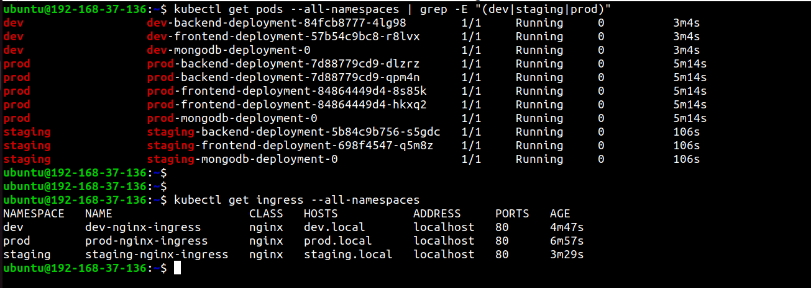

# Managing Multiple Kubernetes Environments with Kustomize

## Overview
Kustomize simplifies Kubernetes configurations by allowing environment-specific customizations without modifying the base YAML files. This part demonstrates how to manage multiple environments using Kustomize with ingress-based routing, enabling you to deploy and access different versions of your MERN application through distinct hostnames.

## Environment Stages
We have configured the following environments with separate namespaces and ingress hosts:

- **Development (`overlays/dev`)** - Accessible via `dev.local`
- **Staging (`overlays/staging`)** - Accessible via `staging.local`  
- **Production (`overlays/prod`)** - Accessible via `prod.local`

### Environment Matrix

| Environment | Namespace | Host | Replicas | Prefix |
|-------------|-----------|------|----------|--------|
| **Development** | `dev` | `dev.local` | 1 | `dev-` |
| **Staging** | `staging` | `staging.local` | 1 | `staging-` |
| **Production** | `prod` | `prod.local` | 2 | `prod-` |


## Configuration Management
We use `configMapGenerator` and `secretGenerator` in Kustomize to manage ConfigMaps and Secrets. Each environment has its own backend configuration with environment-specific MongoDB URLs.

## Prerequisites

### 1. Install Nginx Ingress Controller
Before deploying any environment, ensure the Nginx Ingress Controller is installed:

```bash
kubectl apply -f https://kind.sigs.k8s.io/examples/ingress/deploy-ingress-nginx.yaml
```

Wait for the ingress controller to be ready:

```bash
kubectl wait --namespace ingress-nginx \
  --for=condition=ready pod \
  --selector=app.kubernetes.io/component=controller \
  --timeout=90s
```

### 2. Configure /etc/hosts
To access the applications via their respective hostnames, add the following entries to your `/etc/hosts` file:

```bash
# Get your cluster's ingress IP (usually localhost for kind clusters)
kubectl get service -n ingress-nginx ingress-nginx-controller

# Add these entries to /etc/hosts
sudo tee -a /etc/hosts << EOF
127.0.0.1 dev.local
127.0.0.1 staging.local
127.0.0.1 prod.local
EOF
```

**Note:** For kind clusters, the ingress typically uses `127.0.0.1`. For other cluster types, replace with the actual ingress IP.

## Step-by-Step Deployment Guide

### Step 1: Verify Kustomize Configuration
Before deploying, verify the configurations for each environment:

```bash
# Verify Development environment
kubectl kustomize kustomize/overlays/dev

# Verify Staging environment  
kubectl kustomize kustomize/overlays/staging

# Verify Production environment
kubectl kustomize kustomize/overlays/prod
```

### Step 2: Deploy Development Environment

```bash
# Deploy to Development
kubectl apply -k kustomize/overlays/dev

# Verify deployment
kubectl get pods -n dev
kubectl get svc -n dev
kubectl get ingress -n dev
```

Wait for all pods to be running:

```bash
kubectl wait --for=condition=ready pod --all -n dev --timeout=300s
```

**Access Development Application:**
Open your browser and navigate to: `http://dev.local`

### Step 3: Deploy Staging Environment

```bash
# Deploy to Staging
kubectl apply -k kustomize/overlays/staging

# Verify deployment
kubectl get pods -n staging
kubectl get svc -n staging
kubectl get ingress -n staging
```

Wait for all pods to be running:

```bash
kubectl wait --for=condition=ready pod --all -n staging --timeout=300s
```

**Access Staging Application:**
Open your browser and navigate to: `http://staging.local`

### Step 4: Deploy Production Environment

```bash
# Deploy to Production
kubectl apply -k kustomize/overlays/prod

# Verify deployment
kubectl get pods -n prod
kubectl get svc -n prod
kubectl get ingress -n prod
```

Wait for all pods to be running:

```bash
kubectl wait --for=condition=ready pod --all -n prod --timeout=300s
```

**Access Production Application:**
Open your browser and navigate to: `http://prod.local`

## Post-Deployment Verification

### Check All Environments
```bash
# View all namespaces
kubectl get namespaces

# Check pods across all environments
kubectl get pods --all-namespaces | grep -E "(dev|staging|prod)"

# Check ingress configurations
kubectl get ingress --all-namespaces
```



## Application Testing
| Environment | Frontend URL | API Endpoint |
|-------------|--------------|--------------|
| Development | http://dev.local | http://dev.local/books |
| Staging | http://staging.local | http://staging.local/books |
| Production | http://prod.local | http://prod.local/books |


#### Environment Screenshots

*Development Environment*


*Staging Environment*


*Production Environment*

### Accessing Applications Without /etc/hosts
If you prefer not to modify `/etc/hosts`, you can access applications using port-forwarding:

```bash
# Port-forward development ingress
kubectl port-forward -n ingress-nginx service/ingress-nginx-controller 8080:80

# Then access via:
# http://localhost:8080 (with Host: dev.local header)
```

## Cleanup

### Delete Specific Environment
```bash
# Delete development environment
kubectl delete -k kustomize/overlays/dev

# Delete staging environment
kubectl delete -k kustomize/overlays/staging

# Delete production environment
kubectl delete -k kustomize/overlays/prod
```

### Delete All Environments
```bash
# Delete all application namespaces
kubectl delete namespace dev staging prod
```

### Remove /etc/hosts Entries
```bash
# Remove the added entries from /etc/hosts
sudo sed -i '/dev.local/d; /staging.local/d; /prod.local/d' /etc/hosts
```

---